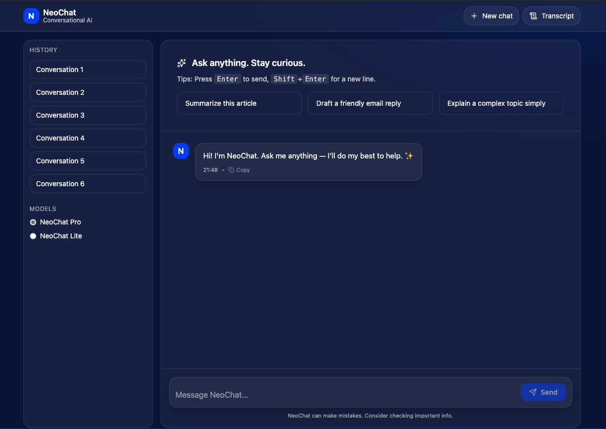

# NeoChat – Conversational AI

NeoChat is a modern AI chatbot web application featuring a sleek React frontend and a Node.js (Express) backend. Powered by the OpenAI API, it delivers a conversational experience similar to ChatGPT, with real-time chat, conversation history, and model selection.



## ✨ Features

- Real-time chat interface
- Conversation history panel
- Model selection (NeoChat Pro, NeoChat Lite)
- Quick action buttons for common tasks
- Modern, responsive UI
- Integration with OpenAI's GPT models
- Fast and lightweight (Vite + React)

## 🛠️ Technologies

- React (TypeScript)
- Vite
- Node.js (Express)
- OpenAI API

## 🗂️ Project Structure

- `client/` — Frontend React app (TypeScript, Vite)
- `server/` — Express backend API
- `public/` — Static assets
- `README.md` — Project documentation

## 📦 Requirements

- Node.js (v18+ recommended)
- OpenAI API key
- Any editor (VS Code recommended)

## 🚀 Running the Project

```bash
# 1. Clone the repository
git clone https://github.com/lyamtorres/ai-chatbot.git
cd ai-chatbot

# 2. Set up the backend
cd server
npm install
cp .env.example .env
# Add your OpenAI API key to .env
npm start
# Backend runs at http://localhost:3000

# 3. Set up the frontend (in a new terminal)
cd ../client
npm install
npm run dev
# Frontend runs at http://localhost:5173
```

## 🎯 Purpose

NeoChat provides a simple, extensible environment for experimenting with conversational AI, modern frontend development, and API integration. It’s ideal for learning about:

- Building chat UIs with React
- Connecting to AI APIs (OpenAI)
- Structuring full-stack JavaScript projects

## 📸 App Interface

The interface is designed for clarity and ease of use:

- Conversation history on the left
- Model selection below history
- Main chat area with message input and quick actions

Refer to the `app-interface` file for more details about the UI implementation and structure.
